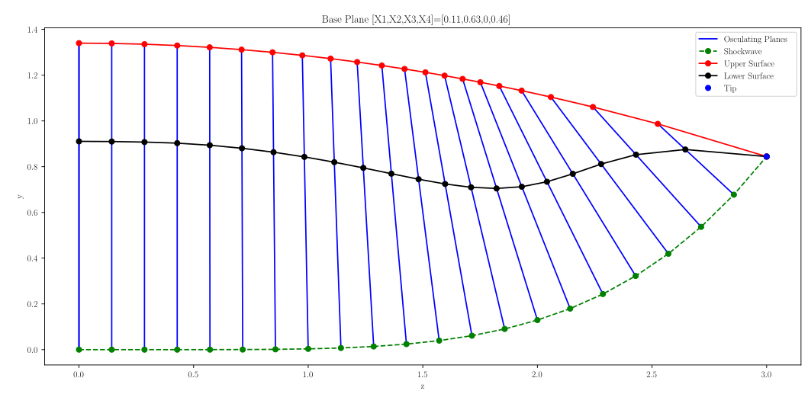
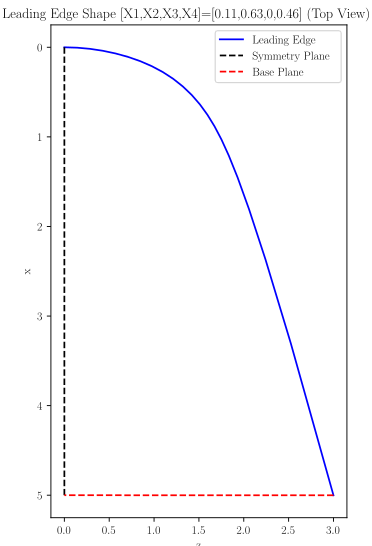

# Waverider Generator

Waverider Generator is a python package which can be used to generate hypersonic waveriders based on an efficient parametrisation described in [1].
The method makes use of the oscultating cone inverse design method and four design parameters `X1`, `X2`, `X3` and `X4`.

|  |
|:---------------------------:|
| Example of generated waverider |

## Required Inputs
- Design parameters `X1`, `X2`, `X3` and `X4`. Note this is entered as a list `dp` of four elements where the parameters are organised in the order listed here. Refer to the examples.
- Freestream Mach number `M_inf`.
- Shock angle in degrees `beta`.
- Height of the waverider at the base plane `height`.
- Width of the waverider `width`. Note that this refers to half of the total width of the waverider due to the symmetry.
- Number of points to be used for interpolating the shockwave and the upper surface curve (`n_shockwave` and `n_upper_surface` respectively). Both are integers greater than 10 to preserve quality.
## Optional Inputs
- Number of osculating planes used in the generation of the geometry `n_planes`. Note that this doesn't include the symmetry plane and the tip. A minimum number of planes is set at 10 to preserve quality and this is the default value.
- Number of points in the streamwise direction for the generation of the upper surface as well as the flat part of the shockwave on the lower surface `n_streamwise`. A minimum is set at 10 to preserve quality and this is the default value.
- Maximum step to be used in the tracing of the streamlines for the lower surface `delta_streamwise`. Note this is entered as a percentage of the length of the waverider and a maximum is set at 20% to preserve quality. The default value is 5%.

## Summary of inputs
|Input|Type|Conditions|
|:-------------:|:--------------:|:--------------:|
| `X1`, `X2`, `X3` and `X4` | `list` | $0\leq X1,X2,X3,X4 \leq 1$ <br> $\frac{X2}{\left(1-X1\right)^4}\leq\ \frac{7}{64}\left(\frac{width}{height}\right)^4$<br>(see [1] for more information on this design condition) |
| `M_inf` | `float`, `int` | `M_inf>0` |
|`beta`| `float`, `int`| `0<beta<90`|
|`height`| `float`, `int`| `height>0`|
|`width`| `float`, `int`| `width>0`|
|`n_shockwave` and `n_upper_surface`| `int`| `n_shockwave,n_upper_surface>=10`
|`n_planes`|`int`|`n_planes>=10`|
|`n_streamise`|`int`|`n_streamwise>=10`|
|`delta_streamise`|`float`|`0<delta_streamwise<=0.2`|

# Usage and functionality

A user can create a `waverider` instance by importing the `waverider` class from `waverider_generator.generator`. Everything takes place inside the class constructor so the user only needs to initialise the instance to create the geometry. An example is shown below: <br>
```python
from waverider_generator.generator import waverider as wr
M_inf=5
beta=15
height=1.34
width=3
dp=[0.11,0.63,0,0.46]
n_planes=20
n_streamwise=10
delta_streamwise=0.1
waverider=wr(M_inf=M_inf,beta=beta,height=height,width=width,dp=dp,n_upper_surface=10000,n_shockwave=10000,n_planes=n_planes,n_streamwise=n_streamwise,delta_streamise=delta_streamwise)
```
## CAD Export
To export the geometry into a file CAD, the user can import the `to_CAD` function from `waverider_generator.cad_export`. An example is shown below: <br>

```python
#%%
# assuming a waverider instance has been created with the code above
from waverider_generator.cad_export import to_CAD

waverider_cad=to_CAD(waverider=waverider,sides='both',export=True,filename='waverider.step')
waverider_cad
```

The `to_CAD` function is detailed below:

|Input|Type|Conditions|Description|
|:-------------:|:--------------:|:--------------:|:--------------:|
| `waverider` | `waverider` | NA|`waverider` instance|
| `sides`| `str` | `left`, `right` or `both` <br> | Side(s) of the waverider to generate in the CAD|
|`export`| `bool` |`True` or `False`| Setting this to `True` exports the CAD to the current directory, `False` does not|
|`filename`| `str`| The extension must be one which `cadquery` can generate a CAD file in| Name of the CAD file to be created|

|Output|Type|Conditions|Description|
|:-------------:|:--------------:|:--------------:|:--------------:|
`waverider_cad`| `cq.Solid` (cadquery solid) | NA | A cadquery solid corresponding to the waverider generated. This can be previewed in a Jupyter Notebook, therefore avoiding the step of exporting and importing into a seperate CAD software each time.|

## Plotting tools

The package also allows the user to plot basic figures to analyse the geometry generated before a CAD export. This is done by importing `Plot_Base_Plane` and `Plot_Leading_Edge` from `waverider_generator.plotting_tools`. An example, also included as an example file, is shown below:

```python
#%%
from waverider_generator.generator import waverider as wr
from waverider_generator.plotting_tools import Plot_Base_Plane,Plot_Leading_Edge
import matplotlib.pyplot as plt

M_inf=5
beta=15
height=1.34
width=3
dp=[0.11,0.63,0,0.46]
n_planes=20
n_streamwise=10
delta_streamwise=0.1
waverider=wr(M_inf=M_inf,beta=beta,height=height,width=width,dp=dp,n_upper_surface=10000,n_shockwave=10000,n_planes=n_planes,n_streamwise=n_streamwise,delta_streamise=delta_streamwise)
#%%
'''
PLOT BASE PLANE
'''
base_plane=Plot_Base_Plane(waverider=waverider)
#%%
'''
PLOT LEADING EDGE
'''
leading_edge=Plot_Leading_Edge(waverider=waverider)
plt.show()
```
|  |  |
|:---------------------------:|:---------------------------:|
| Base plane plot| Leading edge plot           |

# License
MIT License

Copyright (c) 2024 jade5638

Permission is hereby granted, free of charge, to any person obtaining a copy
of this software and associated documentation files (the "Software"), to deal
in the Software without restriction, including without limitation the rights
to use, copy, modify, merge, publish, distribute, sublicense, and/or sell
copies of the Software, and to permit persons to whom the Software is
furnished to do so, subject to the following conditions:

The above copyright notice and this permission notice shall be included in all
copies or substantial portions of the Software.

THE SOFTWARE IS PROVIDED "AS IS", WITHOUT WARRANTY OF ANY KIND, EXPRESS OR
IMPLIED, INCLUDING BUT NOT LIMITED TO THE WARRANTIES OF MERCHANTABILITY,
FITNESS FOR A PARTICULAR PURPOSE AND NONINFRINGEMENT. IN NO EVENT SHALL THE
AUTHORS OR COPYRIGHT HOLDERS BE LIABLE FOR ANY CLAIM, DAMAGES OR OTHER
LIABILITY, WHETHER IN AN ACTION OF CONTRACT, TORT OR OTHERWISE, ARISING FROM,
OUT OF OR IN CONNECTION WITH THE SOFTWARE OR THE USE OR OTHER DEALINGS IN THE
SOFTWARE.

-----------
# References

[1] Jiwon Son, Chankyu Son, and Kwanjung Yee. 
'A Novel Direct Optimization Framework for Hypersonic Waverider Inverse Design Methods'.
In: Aerospace 9.7 (June 2022), p. 348. issn: 2226-4310. doi: 10.3390/aerospace9070348.
